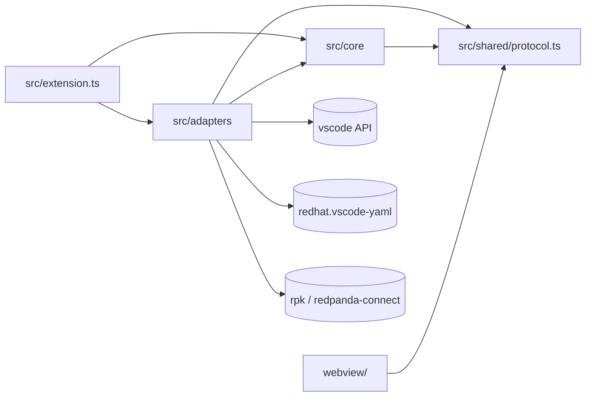
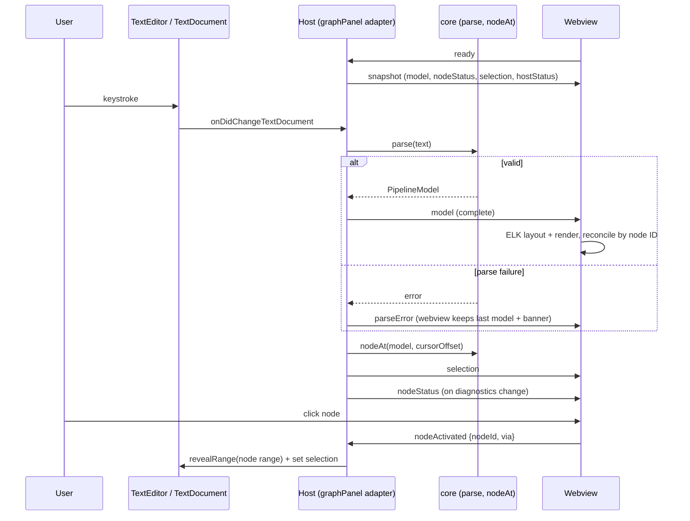

# Architecture Spine — Redpanda Connect Designer for VS Code

## Design Paradigm

**Unidirectional data flow (host→webview) + ports-and-adapters in the extension host.** The `TextDocument` is the single source of truth. The host parses it into a `PipelineModel` and pushes it to a renderer that holds no domain state. The webview sends back only user-intent messages, and the host decides every effect.

| Layer | Directory | Role |
| --- | --- | --- |
| Core (pure) | `src/core/` | YAML→`PipelineModel`, `nodeAt`, lint-output parser, detection predicate, schema transform. No `vscode` import, no process spawning. |
| Adapters | `src/adapters/` | `vscode` (providers, diagnostics, Quick Fixes, commands, DetectionRegistry), `redpandaConnect` (binary, schema, lint, run), `redhatYaml` (schema contributor), `graphPanel` (WebviewPanel, messaging, NodeStatusService). |
| Shared contract | `src/shared/protocol.ts` | `PipelineModel` + every host↔webview message. |
| Composition root | `src/extension.ts` | Wires core and adapters at activation. |
| Renderer | `webview/` | React + @xyflow/react + ELK layout. Imports only `src/shared/`. |

## Invariants & Rules

### AD-1 — Native text editor + graph WebviewPanel beside it (Markdown-preview pattern) [ADOPTED]

- **Binds:** `src/adapters/graphPanel`, `src/adapters/vscode`, `src/adapters/redpandaConnect` (terminals), all YAML editing
- **Prevents:** a second editor implementation (Monaco in the webview); loss of native editor features; adapters keying per-file state differently; locking the wrong editor group
- **Rule:**
  - The native `TextEditor` owns all text. The graph is a `WebviewPanel` in `ViewColumn.Beside`. One graph panel per document, reused on re-open. No single-tab sash layout and no Split/Graph/YAML switcher.
  - Every per-file registry (graph panel, terminal, detection) is keyed by `uri.toString()` and re-keyed on rename / Save As.
  - The **driving editor** is the last-focused text editor for that URI. It is the cursor-highlight source and the `revealRange` target.
  - The panel closes when `window.tabGroups` holds no tab for that URI's YAML.
  - Group lock (best-effort): on first open, reveal the panel with focus, run `workbench.action.lockEditorGroup`, then refocus the text editor.
  - The host sends a full `snapshot` when the webview posts `ready`.
  - `retainContextWhenHidden: false`; the webview restores view state via `setState` (AD-3). `[ASSUMPTION]`
  - Auto-open beside a detected file (AD-18) unless the setting disables it. A Show graph / Hide graph command and editor-title button toggle the panel; no default keybinding. An explicit Hide is persisted per URI in `workspaceState` (survives reload) and suppresses auto-open until Show graph.

### AD-2 — TextDocument is the single source of truth; only the host parses YAML [ADOPTED]

- **Binds:** `src/core`, `webview/`, all features reading config structure
- **Prevents:** two YAML parsers disagreeing; the graph showing something diagnostics don't
- **Rule:** Only `src/core` parses YAML, with `yaml` (eemeli) and a `LineCounter`. No other module, including `webview/`, parses YAML or keeps its own copy of the config text. All state comes from the current `TextDocument`.

### AD-3 — Webview renders and emits intents; it holds view state only [ADOPTED]

- **Binds:** `webview/`, `src/adapters/graphPanel`
- **Prevents:** effect logic split across host and webview; the webview mutating documents or the editor; collapse/viewport state split between host and webview or lost on hide
- **Rule:** The webview renders the latest model it was sent and posts only user-intent messages (AD-5). It never edits text, moves the cursor, spawns work, calls VS Code APIs or re-derives the model. It may hold view-only ephemeral state keyed by node ID (group collapse, viewport/pan-zoom, focus), persisted with `vscode.getState/setState`, and never domain state. The host decides and performs every effect, such as `revealRange`.

### AD-4 — Layout computed in the webview; the model has no coordinates [ADOPTED]

- **Binds:** `src/shared/protocol.ts`, `src/core`, `webview/`
- **Prevents:** presentation details leaking into the core model; divergent ELK worker loading
- **Rule:** `PipelineModel` holds nodes, edges, groups and text ranges, with no positions or sizes. The webview runs ELK (`elk.bundled.js`, on the main thread, no worker, `INCLUDE_CHILDREN` compound layout) on every model it receives.

### AD-5 — One shared protocol module as a discriminated union [ADOPTED]

- **Binds:** `src/shared/protocol.ts`, `src/adapters/graphPanel`, `webview/`
- **Prevents:** host and webview drifting on message or model shapes or names
- **Rule:** `src/shared/protocol.ts` defines `PipelineModel` and every host↔webview message as a discriminated union on `type`. Both sides import it, and no message type is defined anywhere else. Minimum union:

| Direction | Messages |
| --- | --- |
| host→webview | `snapshot` / `model` {PipelineModel}, `parseError` {message, range}, `nodeStatus` {byId}, `selection` {nodeId \| null}, `hostStatus` {binary, schema} |
| webview→host | `ready`, `nodeActivated` {nodeId, via: 'click' \| 'keyboard'}, `bannerClicked`, `installGuideRequested`, `setPathRequested` |

### AD-6 — Send the complete model on every change; a parse error keeps the last valid model [ADOPTED]

- **Binds:** `src/adapters/graphPanel`, `src/core`, `webview/`
- **Prevents:** diff and patch drift between host and webview state; a blank graph while the user is mid-edit
- **Rule:** On every `TextDocument` change the host re-parses and sends the complete `PipelineModel`, never a diff. If parsing fails, the host sends only `parseError`. The webview then keeps the last valid model, shows a banner, and reconciles by node ID when the next model arrives.

### AD-7 — Node IDs: kind-prefixed, label first, else YAML path [ADOPTED]

- **Binds:** `src/core`, `webview/` reconciliation, view state (AD-3), node status (AD-17)
- **Prevents:** unstable or colliding node identities across re-parses; resource and component labels clashing
- **Rule:** The core assigns IDs and no other module invents them. Forms: `label:<label>` for a labelled component, `res:<kind>:<label>` for a resource, `path:<yamlPath>` otherwise (for example `path:output.switch.cases[0].output`). On a duplicate label the first occurrence keeps the label ID; later ones get their path ID and `duplicateLabel: true`.

### AD-8 — Selection is derived from the cursor and text ranges, never from a stored ID [ADOPTED]

- **Binds:** `src/adapters/graphPanel`, `src/adapters/vscode`, `webview/`
- **Prevents:** the selection jumping to the wrong node when inserted nodes shift indices
- **Rule:** After every document change or driving-editor cursor move (AD-1), the host computes `nodeAt(model, cursorOffset)` (AD-16) and sends `selection`. Neither side stores a selected node ID across changes. `nodeActivated` → host → `revealRange` on that node's range in the driving editor.

### AD-9 — A single RedpandaConnect adapter owns all process spawning [ADOPTED]

- **Binds:** `src/adapters/redpandaConnect`, schema, lint and run features, status surfaces
- **Prevents:** divergent binary lookup, version and error handling; lint passing while run fails; duplicate notifications
- **Rule:**
  - Only `src/adapters/redpandaConnect` spawns processes or resolves the binary. Resolution order: `rpk` on PATH (`rpk connect …`), then `redpanda-connect` on PATH, then the binary path setting as a fallback used only when PATH yields no usable binary; a setting naming `rpk` runs as `rpk connect`.
  - It exposes an observable `binaryState`: `unresolved | ok{path, version} | missing | invalid`, with `onDidChange`. A binary older than Redpanda Connect v4.100.0 is `invalid`. A notification fires once per transition into `missing` or `invalid`. The graph gets it as `hostStatus`.
  - One shared argument builder serves lint and run: `--resources` from the `redpandaConnect.resourceFiles` setting only (no automatic resource-file detection), `--env-file` from `redpandaConnect.envFile` (the long flags, as built in 1.5). Lint adds `--deprecated` and `--skip-env-var-check`. `[ASSUMPTION]` Every child gets env `NO_COLOR=1`.

### AD-10 — Schema: generated per binary, transformed once, cache-busted by version [ADOPTED]

- **Binds:** `src/adapters/redpandaConnect`, `src/adapters/redhatYaml`, `src/core` schema transform
- **Prevents:** stale schemas in Red Hat; concurrent regenerations; two sources of hover examples
- **Rule:**
  - The schema comes from `list --format jsonschema`, cached in `globalStorage` keyed by binary path + version.
  - The version is re-read on activation, on settings change and on a `Refresh schema` command. Generation is single-flight.
  - The schema URI embeds `hash(path + version + transform version)`, so Red Hat refetches when the binary or the transform changes.
  - Before caching, one versioned transform runs: add `$schema` draft-07, allow `${...}` interpolation patterns on non-string fields, and merge docs from `list --format json-full` (field `description` + `examples` → `markdownDescription`, `default`, component `summary`). Hover docs come only from this transform; no own `HoverProvider`. Snippets are not part of the schema (CAP-5, epic 2).

### AD-11 — Red Hat YAML is a hard dependency; we supply schema via registerContributor and run no YAML LSP of our own [ADOPTED]

- **Binds:** `package.json` `extensionDependencies`, `src/adapters/redhatYaml`, `src/adapters/vscode` (gap completion)
- **Prevents:** duplicate completion and diagnostics from two YAML language servers
- **Rule:** `redhat.vscode-yaml` is listed in `extensionDependencies`. Our extension supplies the generated schema through its `registerContributor` API as content: `requestSchema` answers only for files the DetectionRegistry (AD-18) accepts, with a URI in our own scheme embedding the schema hash (AD-10), and `requestSchemaContent` serves the JSON from the in-memory schema store, never from the cache file. We never start our own YAML language server and never register our own schema validation. Completion is Red Hat's, with one exception (amended 2026-10-07, ticket 2.16): for detected files the extension adds completion items only where Red Hat 1.24.0 returns none, which is an empty component block (`socket:` with nothing under it), an empty value inside a component (`network: `), or an empty list item inside a component (`switch` case `processors:` then `- `; added 2026-10-08, ticket 2.18). The items come from the same served schema, and in every other position our provider returns nothing, so the two never duplicate.

### AD-12 — Diagnostics ownership and dedupe [ADOPTED]

- **Binds:** `src/adapters/vscode` (diagnostics, Quick Fixes, snippets), `src/core` lint parser
- **Prevents:** duplicate or conflicting squiggles; inconsistent lint parsing
- **Rule:** `rpk connect lint` on save is the authoritative Redpanda Connect validation; it runs on save only, through the AD-9 argument builder. Red Hat YAML provides completion, hover and YAML syntax errors while typing; the binary's schema does not constrain component-level fields (E1 manual check), so schema validation is not relied on for Redpanda Connect errors. The `src/core` parser reads its stderr lines in the form `<path>(<line>,<col>) <message>` (exit 1 means lints were found). A lint diagnostic on the same line as a schema diagnostic is suppressed. Our own providers add only lint diagnostics, Quick Fixes (AD-19) and snippets; hover examples come from the schema (AD-10).

### AD-13 — Run: one Pseudoterminal per file over an adapter-spawned child; Stop signals that child [ADOPTED]

- **Binds:** run commands, `src/adapters/redpandaConnect`, status bar
- **Prevents:** terminal sprawl; running stale on-disk content; Stop with no mechanism or acting on the wrong process; a shell spawning outside AD-9
- **Rule:** Run is disabled for untitled documents. If the file is dirty, Run saves it without prompting, then runs the saved file. Each file has one terminal named `Redpanda Connect: <file name>`, tracked by URI (AD-1) and reused on re-run. The terminal is a `Pseudoterminal` whose child process the RedpandaConnect adapter spawns with the AD-9 arguments; nothing is typed into a shell. Stop (status bar or command) calls `child.kill('SIGINT')` on that file's child and escalates to `SIGKILL` if it has not exited after a grace period; the exit status goes to the status bar. The child is a long-lived, streaming handle from the spawn site (AD-9), not the buffered, timeout-killed one-shot runner.

### AD-14 — Bloblang support: TextMate injection, plus completion and hover for functions and methods [ADOPTED]

- **Binds:** `syntaxes/`, `package.json` grammars
- **Prevents:** a half-built Bloblang language service competing with a later LSP
- **Rule:** Bloblang gets our own TextMate grammar, injected into `source.yaml` and the versioned YAML scopes, for highlighting. Amended 2026-10-08 (user, ticket 2.19): inside Bloblang (the values of the grammar's Bloblang fields and `${! }` interpolations), the extension also offers completion and hover for Bloblang functions and methods, from the binary's own `list --format json-full` docs (the served schema carries them under a private key), so they match the user's version. Still no Bloblang diagnostics (lint on save checks mappings) and no Bloblang language server.

### AD-15 — Dependency direction [ADOPTED]

- **Binds:** all
- **Prevents:** `vscode` leaking into the testable core; the webview coupling to host code
- **Rule:** `src/core` imports nothing from `src/adapters` or `vscode`. `webview/` imports only `src/shared/`. `src/shared/` imports nothing internal. Only `src/extension.ts` wires the adapters together.



### AD-16 — Text ranges and one `nodeAt` [ADOPTED]

- **Binds:** `src/core`, `src/shared/protocol.ts`, `src/adapters/vscode`, `src/adapters/graphPanel`
- **Prevents:** selection and node markers resolving to different nodes; off-by-one line/column conversions
- **Rule:** A node's range runs from the start of its map key (or its `- ` sequence item) to its `valueEnd`, as UTF-16 document offsets `[start, end)`. One core function, `nodeAt(model, offset)`, returns the innermost node containing the offset; selection (AD-8) and node status (AD-17) both use it. Lint `(line, col)` is 1-based and is converted to an offset/`Range` in one adapter function.

### AD-17 — Node status: host maps diagnostics to nodes [ADOPTED]

- **Binds:** `src/adapters/graphPanel` (NodeStatusService), `src/adapters/vscode` diagnostics, `webview/`
- **Prevents:** graph and diagnostics units each picking their own source, mapping or transport for node markers
- **Rule:**
  - The host `NodeStatusService` reads the deduped diagnostics for the URI (Red Hat + lint, AD-12) and ignores churn it caused itself.
  - It maps each diagnostic to a node with `nodeAt` (AD-16). Error beats warning, and severity rolls up to ancestor group headers.
  - It sends `nodeStatus` as its own message, separate from the model. The status is frozen while `parseError` shows. The webview never maps ranges.
  - Warning markers come only from Red Hat warning-severity diagnostics and from `lint --deprecated` findings. Every other lint finding is Error (lint lines carry no severity).
  - Lint diagnostics for the URI are cleared on the first edit after save and recomputed on the next save.

### AD-18 — Detection registry [ADOPTED]

- **Binds:** `src/adapters/vscode` (DetectionRegistry), `src/core` predicate, auto-open (AD-1), schema `requestSchema` (AD-11), lint (AD-12), Run (AD-13)
- **Prevents:** features disagreeing on which files are Redpanda Connect configs
- **Rule:** One per-URI `DetectionRegistry` is the only answer to "is this a Redpanda Connect file". Predicate: matches `redpandaConnect.filePatterns`, OR the content has top-level `input` / `pipeline` / `output` / `buffer` or resource keys, OR the user ran Show graph for the URI this session. It recomputes on open, change and setting change, and fires `onDidChangeDetection`. Auto-open happens only on the first open per session. Resource files are not detected automatically: lint and run get exactly the `redpandaConnect.resourceFiles` setting (AD-9).

### AD-19 — Quick Fix and all extension edits are minimal-range [ADOPTED]

- **Binds:** `src/adapters/vscode`, `src/core` (edit-range computation)
- **Prevents:** losing comments, `${ENV}` references or formatting through a document round-trip
- **Rule:** Every edit the extension makes is a `WorkspaceEdit` replacing only the minimal range, applied only by `src/adapters/vscode`. The core may compute edit ranges. Re-serializing the document (for example `Document.toString()`) is never allowed.

### AD-20 — Component structure comes from the binary's schema [ADOPTED]

- **Binds:** `src/core` (YAML → PipelineModel), `src/adapters/redpandaConnect` (schema, AD-10), `src/adapters/graphPanel`, `webview/` empty state
- **Prevents:** the parser and the schema disagreeing on which fields hold child components; a hand-maintained table drifting from the user's runtime, plugins or edition
- **Rule:** The core builds the PipelineModel from the YAML plus a `ComponentCatalog` passed in as a pure input. The catalog is derived from the cached, transformed schema (AD-10) and says, per component, which fields hold child components or component lists (for example `switch.cases[].output`, `branch.processors`). There is no built-in structural table. With no binary or schema (`binaryState` ≠ `ok`), the host sends no model and the webview shows the binary-missing empty state (AD-9).

## Consistency Conventions

| Concern | Convention |
| --- | --- |
| Command and setting IDs | One namespace, `redpandaConnect.*`, for commands (for example `redpandaConnect.showGraph`, `redpandaConnect.hideGraph`, `redpandaConnect.run`, `redpandaConnect.stop`, `redpandaConnect.refreshSchema`) and settings (for example `redpandaConnect.binaryPath`, `redpandaConnect.autoOpenGraph`, `redpandaConnect.filePatterns`, `redpandaConnect.resourceFiles`, `redpandaConnect.envFile`). `[ASSUMPTION]` |
| Message types | camelCase `type` literals in `protocol.ts` (AD-5). Host→webview: nouns or states (`model`, `parseError`, `selection`). Webview→host: past-tense intents (`nodeActivated`, `installGuideRequested`), plus `ready`. |
| Text ranges | AD-16. Adapters convert offsets with `TextDocument.positionAt` / `offsetAt`. |
| File detection | AD-18. The predicate is a pure function in `src/core`; only the registry calls it. |
| Errors | Binary state and its notifications are owned by the RedpandaConnect adapter (AD-9). Other modules get a typed result and never notify on their own. Parse errors go to the webview banner (AD-6), not notifications. |
| Logging | One `OutputChannel` named "Redpanda Connect", created in `src/extension.ts` and passed to the adapters. The core does not log. `[ASSUMPTION]` |
| Config | Settings are read only in adapters and passed to the core as plain values. Settings changes re-resolve the binary and re-read the version (AD-9, AD-10). |
| Tests | Core unit tests, adapter tests and integration tests run under mocha through `@vscode/test-cli` (`npm test`, on VS Code stable and the 1.100.0 floor). The corpus harness runs under vitest against `test/corpus/` configs and real binaries (`npm run test:corpus`). |

## Stack

| Name | Version |
| --- | --- |
| VS Code engine (`engines.vscode`) | ^1.100.0 |
| @types/vscode | 1.100.0 (matches engine; vsce rejects types newer than the engine; generator-code writes latest, so edit after scaffold) |
| VS Code stable (target) | 1.140.0 |
| Node.js (dev / CI) | 24.x LTS (CI `node-version: '24'`, latest 24.x; not pinned to a patch) |
| @types/node | 20.19.43 (20.x, the engine floor's Node) |
| TypeScript | ~6.0.3 (not 7.x) |
| generator-code (scaffold) | 1.12.0 |
| esbuild (two bundles: node extension, browser webview) | 0.28.2 |
| react / react-dom | 19.3.0 / 19.3.0 |
| @types/react / @types/react-dom | 19.3.0 / 19.3.0 |
| @xyflow/react | 12.12.0 |
| elkjs (`elk.bundled.js`) | 0.12.0 |
| yaml (eemeli) | 2.9.1 |
| @vscode-elements/elements | 2.5.1 |
| @vscode/codicons | 0.0.46-24 |
| redhat.vscode-yaml (extensionDependency) | >=1.24.0 stable |
| vitest | 5.0.3 |
| @vscode/test-cli / @vscode/test-electron | 0.0.15 / 3.1.0 |
| @vscode/vsce | 4.0.0 |
| ovsx | 1.2.0 |

## Structural Seed

```text
/
  package.json          # single package; extensionDependencies: redhat.vscode-yaml
  src/
    extension.ts        # activation, composition root, OutputChannel
    core/               # pure: YAML→PipelineModel, nodeAt, lint parser, detection predicate, schema transform
    adapters/
      vscode/           # diagnostics, Quick Fixes, snippets, commands, status bar, DetectionRegistry
      redpandaConnect/  # binaryState, arg builder, schema gen + cache, lint, Pseudoterminal run
      redhatYaml/       # registerContributor schema supply
      graphPanel/       # WebviewPanel lifecycle (beside, locked, 1 per URI), messaging, NodeStatusService
    shared/
      protocol.ts       # PipelineModel + host↔webview discriminated union
  webview/              # React + @xyflow/react + elkjs; imports only src/shared
  syntaxes/             # Bloblang TextMate injection grammar
  test/
    corpus/             # sample Redpanda Connect configs for core tests
```

Edit and navigation flow:



Operational envelope:

| Concern | Decision |
| --- | --- |
| Distribution | POC: GitHub Actions packages a `.vsix` with `vsce package` on every push, installed by hand. Publishing to the VS Code Marketplace (`vsce publish`) and Open VSX (`ovsx`) is parked. |
| Versioning | SemVer 0.x for the POC. `[ASSUMPTION]` |
| Publisher | `ajurcenk` on both VS Code Marketplace and Open VSX; display name "Pipeline Designer for Redpanda Connect"; extension name `rpcn-pipeline-designer` `[ASSUMPTION]`. |
| Environments | Local dev through the Extension Development Host (F5). CI on GitHub Actions, Node 24.x: `@vscode/test-cli` (mocha) + the vitest corpus harness. No server-side infrastructure. |
| CI binary | CI runs parity and corpus tests against Redpanda Connect v4.100.0 (minimum supported) and pinned v4.112.0. |
| Secrets | None for the POC; `VSCE_PAT` and `OVSX_PAT` only once publishing is unparked. |
| Runtime dependencies | The user's local `rpk` or `redpanda-connect` binary (AD-9), plus `redhat.vscode-yaml` (AD-11). Minimum supported Redpanda Connect version is v4.100.0. |
| Compatibility | `engines.vscode ^1.100.0`. Only stable APIs, so no proposed `editorInsets`. |
| Licensing | Extension: Apache-2.0. elkjs (EPL-2.0) bundled unmodified, with its license notice. |

## Deferred

| Item | Why it can wait |
| --- | --- |
| Lint while typing (temp file) | Live schema validation covers typing. Revisit if save-only lint feels slow. |
| ~~Lint via stdin~~ Closed | Spike 1.1: `lint` does not read stdin (`-` is opened as a file and fails), so lint always gets a file path. |
| Panel restore after reload (`WebviewPanelSerializer`) | POC reopens via auto-open or Show graph (AD-1). |
| ELK in a web worker | Main-thread `elk.bundled.js` is enough for POC-sized configs (AD-4). |
| Bloblang LSP (teyfix/bloblang-lsp) | Young project. Highlighting is enough for the first release. |
| Graph editing + YAML write-back (yaml Document API / minimal edits) | The first release is read-only. AD-2/AD-3/AD-19 already route any later edits through host intents and minimal ranges. |
| Large configs (thousands of lines) | Out of scope. Complete-model resend (AD-6) is sized for typical configs. |
| Streams mode (multiple pipelines) | Out of scope in the brief. |
| BYOC deploy | Later phase. Keep the deployment target separate in the data model when it arrives. |
| Testing (`rpk connect test`), debugging, metrics, AI assist | Later phases in the brief. They will build on the RedpandaConnect adapter (AD-9). |
| elkjs license | Accepted for the POC. Revisit before 1.0 (alternative: @dagrejs/dagre 3.1.1, MIT). |
| Bundled schema fallback | Parked in the brief. The schema always comes from the user's binary for now. |
| Telemetry | Not needed for a POC. Not decided. |
| i18n | English only for the POC. Not decided. |

## Open Questions

- Standalone `redpanda-connect` vs `rpk connect` subcommand parity: verify in the first spike.
- Lint output format and `list --format jsonschema` output: verify against the real binary in the first spike.
